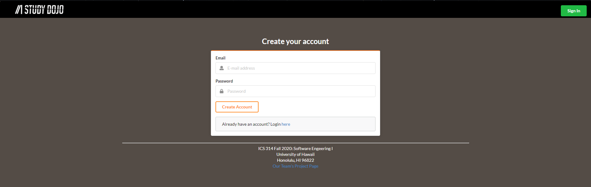
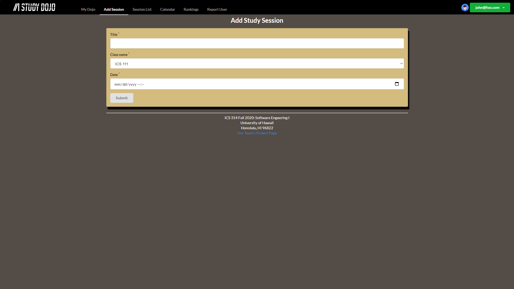

## Table of Contents

* [Overview](#overview)
* [User Interference Walkthrough](#user-interference-walkthrough)
* [Community Feedback](#community-feedback)
* [Development History](#development-history)
* [Contact Us](#contact-us)

## Overview
Study Dojo is a website that enables students to help learn from and teach their peers. Students can register as "sensei" for classes they willing to attempt to help and "grasshopper" for classes they are currently enrolled in. For each course they are registered as grasshopper, students can propose study sessions around a topic and a time. This notifies all grasshoppers and sensei for that course, allowing them to respond if they intend to attend the study session. 

## User Interference Walkthrough
### Landing Page
When you first bring up Study Dojo, you'll see a landing page that provides a brief introduction to the capabililties of Study Dojo:

Click [here](http://206.189.215.47/#/) for a running deployment of the Landing Page

### Sign in Page
Click the green "Sign In" button to bring up a page for the user to sign into their account:

Click [here](http://206.189.215.47/#/signin) for a running deployment of the Sign In Page

### Sign up Page
If the user doesn't have an account, they can click on the blue "here" at the bottom to bring up the Sign Up Page to register their account:

Click [here](http://206.189.215.47/#/signup) for a running deployment of the Sign Up Page

### User Home Page
After signing in, the system will bring the user to their home page. The User Home Page is similar to the Landing Page, but their NavBar will be updated to allow the user to access several pages:

Click [here](http://206.189.215.47/#/) for a running deploymenht of the Home Page

### My Dojo Page
Clicking on "My Dojo" will bring the user to a page to see the classes they are regsitered under as "Dojo" and their status, which is either "grasshopper" or "sensei":

Click [here](http://206.189.215.47/#/mydojo) for a running deployment of the My Dojo Page

### Add Session Page
Clicking on "Add Session" will bring the user to a page where they can create a study session. The user can fill out the form to create a new study session:

Click [here](http://206.189.215.47/#/add) for a running deployment of the Add Session Page

### Session List Page
Clicking on "Sesson List" will bring the user to a page with all the study sessions they are currently registered for:

Click [here](http://206.189.215.47/#/list) for a running deployment of the Session List Page

### Calendar Page
Clicking on "Calender" will bring the user to a page with a calendar that is currently empty, but will be updated to show all the study sessions:

Click [here](http://206.189.215.47/#/calendar) for a running deployment of the Calendar Page

### Study Dojo
You can click [here](http://206.189.215.47/#/) for a running deployment of Study Dojo.

## Community Feedback
We would like to hear from you! If you liked or disliked your experience while using Study Session Planner, feel free to fill out this [feedback form](https://forms.gle/A39VHSd7ctdDkycN7). It only takes a few minutes, and any feedback is much appreciated.

## Development History

### Completed Issues for Milestone 1
See the [project board "M1"](https://github.com/study-dojo/study-dojo/projects/1) for a list of issues completed for milestone 1.

### Issues for Milestone 2
See the [project board "M2"](https://github.com/study-dojo/study-dojo/projects/2) for a list of issues expected to be addressed for milestone 2.

## Contact Us
You can email the creators of Study Dojo at:  
darnellg@hawaii.edu  
jryoung@hawaii.edu  
kevinq22@hawaii.edu  
marj8@hawaii.edu  
  
