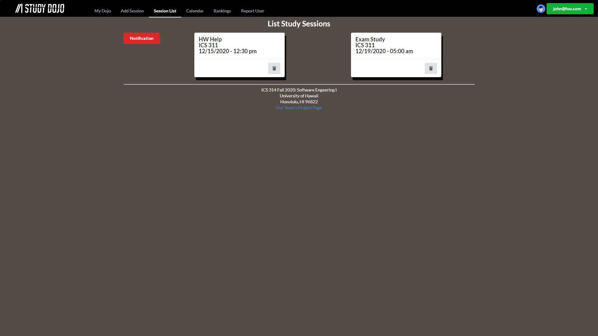
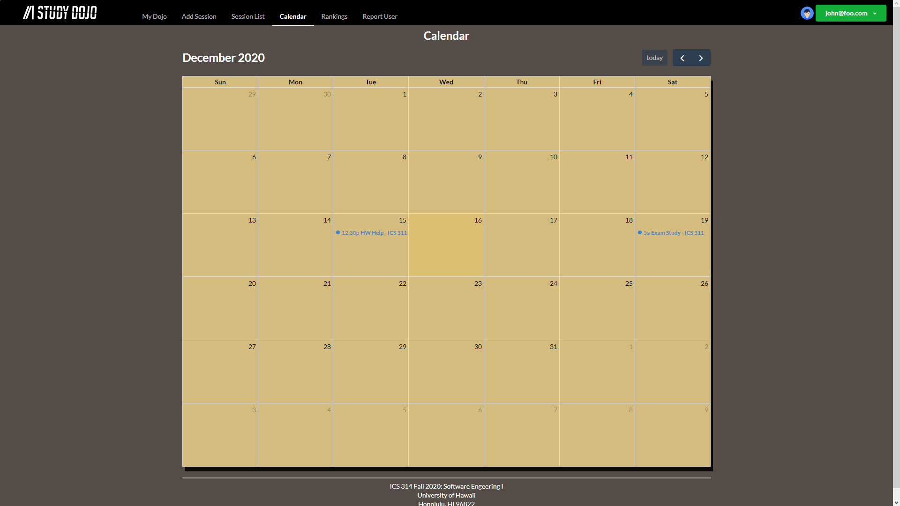

## Table of Contents
* [Deployment](#deployment)
* [Overview](#overview)
* [User Interface Walkthrough](#user-interface-walkthrough)
* [Developer Guide](#developer-guide)
* [Community Feedback](#community-feedback)
* [Development History](#development-history)
* [Contact Us](#contact-us)

## Deployment
Click [here](https://study-dojo.me) for a running deployment of Study Dojo.

## Overview
Study Dojo is a website that enables students to help learn from and teach their peers. Students can register as "sensei" for classes they willing to attempt to help and "grasshopper" for classes they are currently enrolled in. For each course they are registered as grasshopper, students can propose study sessions around a topic and a time. This notifies all grasshoppers and sensei for that course, allowing them to respond if they intend to attend the study session. 

## User Interface Walkthrough
### Landing Page
When you first bring up Study Dojo, you'll see a landing page that provides a brief introduction to the capabililties of Study Dojo:


Click [here](http://206.189.215.47/#/) for a running deployment of the Landing Page


### Sign in Page
Click the green "Sign In" button to bring up a page for the user to sign into their account:


Click [here](http://206.189.215.47/#/signin) for a running deployment of the Sign In Page


### Sign up Page
If the user doesn't have an account, they can click on the blue "here" at the bottom to bring up the Sign Up Page to register their account:


Click [here](http://206.189.215.47/#/signup) for a running deployment of the Sign Up Page


### User Home Page
After signing in, the system will bring the user to their home page. The User Home Page is similar to the Landing Page, but their NavBar will be updated to allow the user to access several pages:


Click [here](http://206.189.215.47/#/) for a running deploymenht of the Home Page


### My Dojo Page
Clicking on "My Dojo" will bring the user to a page to see the classes they are regsitered under as "Dojo" and their status, which is either "grasshopper" or "sensei":


Click [here](http://206.189.215.47/#/mydojo) for a running deployment of the My Dojo Page


### Add Session Page
Clicking on "Add Session" will bring the user to a page where they can create a study session. The user can fill out the form to create a new study session:


Click [here](http://206.189.215.47/#/add) for a running deployment of the Add Session Page


### Session List Page
Clicking on "Sesson List" will bring the user to a page with all the study sessions they are currently registered for:


Click [here](http://206.189.215.47/#/list) for a running deployment of the Session List Page


### Study Session Notification
If another user created a study session for the same class you're registered for, you can click the "Notification" button to get an alert asking if you want to attend the study session. Clicking "OK" will automatically add the study session to your Session List Page. Here's an example of the alert:


### Calendar Page
Clicking on "Calender" will bring the user to a page with a calendar that is currently empty, but will be updated to show all the study sessions:


Click [here](http://206.189.215.47/#/calendar) for a running deployment of the Calendar Page


## Developer Guide

### Installation
First - [install meteor](https://www.meteor.com/install)

Second - download a copy of [study-dojo](https://github.com/study-dojo/study-dojo).

Third - cd into the app/ directory of your local repo and install third party libraries with:

```
$ meteor npm install
```

### Running Locally
To run the app locally, invoke the following code:

```
$ meteor npm run start
```

The first time you run the app, it will create default users and data for the app. Here is an example:

```
$ meteor npm run start

> meteor-application-template-react@ start C:\Users\justi\OneDrive\Documents\GitHub\github\study-dojo\app
> meteor --no-release-check --exclude-archs web.browser.legacy,web.cordova --settings ../config/settings.development.json

[[[[[ C:\Users\justi\OneDrive\Documents\GitHub\github\study-dojo\app ]]]]]

=> Started proxy.
=> Started MongoDB.
W20201201-15:21:56.100(-10)? (STDERR) Note: you are using a pure-JavaScript implementation of bcrypt.
W20201201-15:21:56.518(-10)? (STDERR) While this implementation will work correctly, it is known to be
W20201201-15:21:56.519(-10)? (STDERR) approximately three times slower than the native implementation.
W20201201-15:21:56.519(-10)? (STDERR) In order to use the native implementation instead, run
W20201201-15:21:56.519(-10)? (STDERR) 
W20201201-15:21:56.520(-10)? (STDERR)   meteor npm install --save bcrypt
W20201201-15:21:56.520(-10)? (STDERR) 
W20201201-15:21:56.520(-10)? (STDERR) in the root directory of your application.
I20201201-15:21:57.477(-10)? Creating the default user(s)
I20201201-15:21:57.478(-10)?   Creating user admin@foo.com.
I20201201-15:21:57.685(-10)?   Creating user john@foo.com.
I20201201-15:21:57.852(-10)?   Creating user bob@foo.com.
I20201201-15:21:58.024(-10)? Creating default Study Sessions.
I20201201-15:21:58.025(-10)?   Adding: Help with HW (john@foo.com)
I20201201-15:21:58.040(-10)?   Adding: Exam Study (john@foo.com)
I20201201-15:21:58.043(-10)? Creating default dojo data.
I20201201-15:21:58.044(-10)?   Adding: ICS 314 (john@foo.com)
I20201201-15:21:58.065(-10)?   Adding: ICS 311 (john@foo.com)
I20201201-15:21:58.067(-10)?   Adding: ICS 311 (bob@foo.com)
I20201201-15:21:58.121(-10)? Monti APM: completed instrumenting the app
=> Started your app.

=> App running at: http://localhost:3000/
   Type Control-C twice to stop.
```

**Note on pure-Javascript implementation of bcrypyt.** The following message appears whenever you invoke **meteor npm run start**:

```
Note: you are using a pure-JavaScript implementation of bcrypt.
While this implementation will work correctly, it is known to be
approximately three times slower than the native implementation.
In order to use the native implementation instead, run

  meteor npm install --save bcrypt
```

On some operating systems (ex. Windows), installing Bcrypt is much more difficult than the message implied. Meteor only uses Bcrypt for password checking, so in practice, the performance implications are negligible until the site has very high traffic. You can safely ignore this warning during the initial stages of development.

The app should appear at [http://localhost:3000](http://localhost:3000). You can login using the credentials in [settings.development.json](https://github.com/study-dojo/study-dojo/blob/master/config/settings.development.json), or register or a new account.


### Deploying the App
The team behind Study Dojo uses [Meteor Up](http://meteor-up.com/) to deploy our app. Install Meteor Up by invoking:

```
$ npm install --global mup
```

In the app/.deploy directory, you'll find two files: "mup.sample.js" and "settings.sample.json". Make a copy of these two files and call them "mup.js" and "settings.json" respectively. The .deploy directory should look like this:


To change where the app deploys, you need to edit the "mup.js" file. It should initially look like this:

```
module.exports = {
  servers: {
    one: {
      host: '111.222.333.444',
      username: 'root',
      password: 'changeme'
    }
  },

  app: {
    name: 'meteor-application-template-react',
    path: '../',

    servers: {
      one: {},
    },

    buildOptions: {
      serverOnly: true,
    },

    env: {
      ROOT_URL: 'http://111.222.333.444',
      MONGO_URL: 'mongodb://mongodb/meteor',
      MONGO_OPLOG_URL: 'mongodb://mongodb/local',
    },

    docker: {
      image: 'abernix/meteord:node-12-base',
    },

    enableUploadProgressBar: true
  },

  mongo: {
    version: '3.4.1',
    servers: {
      one: {}
    }
  },
};
```

There are three occurences of study-dojo.me, these need to be changed to the new IP or domain name to change where the app is deployed.


**Note for Window users, on instances of "mup", use "mup.cmd" instead.**

Deploy your app by invoking:

```
$ mup setup
```

**Note STDERR** You may get an error when trying to set up the proxy. That's okay, continue on to the next step. An example of the error may be:

```
$ mup setup

Started TaskList: Setup Docker
[study-dojo.me] - Setup Docker
[study-dojo.me] - Setup Docker: SUCCESS

Started TaskList: Setup Meteor
[study-dojo.me] - Setup Environment
[study-dojo.me] - Setup Environment: SUCCESS

Started TaskList: Setup Mongo
[study-dojo.me] - Setup Environment
[study-dojo.me] - Setup Environment: SUCCESS
[study-dojo.me] - Copying Mongo Config
[study-dojo.me] - Copying Mongo Config: SUCCESS

Started TaskList: Start Mongo
[study-dojo.me] - Start Mongo
[study-dojo.me] - Start Mongo: SUCCESS

Started TaskList: Setup proxy
[study-dojo.me] - Setup Environment
[study-dojo.me] - Setup Environment: SUCCESS
[study-dojo.me] - Pushing the Startup Script
[study-dojo.me] - Pushing the Startup Script: SUCCESS
[study-dojo.me] - Pushing Nginx Config Template
[study-dojo.me] - Pushing Nginx Config Template: SUCCESS
[study-dojo.me] - Pushing Nginx Config
[study-dojo.me] - Pushing Nginx Config: SUCCESS
[study-dojo.me] - Cleaning Up SSL Certificates
[study-dojo.me] - Cleaning Up SSL Certificates: SUCCESS
[study-dojo.me] - Configure Nginx Upstream
[study-dojo.me] - Configure Nginx Upstream: SUCCESS

Started TaskList: Start proxy
[study-dojo.me] - Start proxy
[study-dojo.me] x Start proxy: FAILED

	      ------------------------------------STDERR------------------------------------
	      Error response from daemon: endpoint mup-nginx-proxy not found
	Error response from daemon: network mup-proxy not found
	Error: No such container: mup-nginx-proxy-letsencrypt
             :
             :
$
```

Second, invoke:

```
$ mup reconfig
```

You should get a similar output to the following:

```
$mup reconfig

Started TaskList: Configuring App
[study-dojo.me] - Pushing the Startup Script
[study-dojo.me] - Pushing the Startup Script: SUCCESS
[study-dojo.me] - Sending Environment Variables
[study-dojo.me] - Sending Environment Variables: SUCCESS

Started TaskList: Start Meteor
[study-dojo.me] - Start Meteor
[study-dojo.me] - Start Meteor: SUCCESS
[study-dojo.me] - Verifying Deployment
[study-dojo.me] - Verifying Deployment: SUCCESS
$
```

If "mup setup" failed, then invoke "mup setup" again before invoking the next command.

Lastly, invoke:

```
$ mup deploy
```

**Note.** That "mup deploy" may take a while to finish.


### Modifying the App

## ESLint
You can verify the code follows our coding standard by invoking ESLint with the following code:

```
$ meteor npm run lint
```

## Directory Structure
The top-level directory structure is:

```
app/			# holds the Meteor application sources
config/			# holds configuration files, such as settings.development.json
doc/			# holds documentation files, user guides, etc.
```

The app/ directory structure is:

```
client/		
  main.html		# Boilerplate HTML with a "root" div to be maniuplated by React
  main.js		# import startup files

imports/
  api/			# Define collections
  startup/		# Define code to run on startup
  ui/	
    components/		# Contains page elements
    layouts/		# Contains top-level layout
    pages/		# Contains components for each page
    
node_modules/		# Filled with packages that are managed by npm

public/			# Can be filled with static assets 

server/		
  main.js		# Import server-side js files
  
tests/			## Implementation of testcafe to test code
```

**Note on Import Conventions.**
This system adheres to the Meteor guideline of putting all application code in the "app/imports/" directory, and using "client/main.js" and "server/main.js" to import the appropriate code.


## Community Feedback
We would like to hear from you! If you liked or disliked your experience while using Study Session Planner, feel free to fill out this [feedback form](https://forms.gle/A39VHSd7ctdDkycN7). It only takes a few minutes, and any feedback is much appreciated.

## Development History

### Completed Issues for Milestone 1
See the [project board "M1"](https://github.com/study-dojo/study-dojo/projects/1) for a list of issues completed for milestone 1.

### Completed Issues for Milestone 2
See the [project board "M2"](https://github.com/study-dojo/study-dojo/projects/2) for a list of issues completed for milestone 2.

### Issues for Milestone 3
See the [project board "M3"](https://github.com/study-dojo/study-dojo/projects/4) for a list of issues expected to be addressed for milestone 3.

## Contact Us
You can email the creators of Study Dojo at:  
darnellg@hawaii.edu  
jryoung@hawaii.edu  
kevinq22@hawaii.edu  
marj8@hawaii.edu  
  
